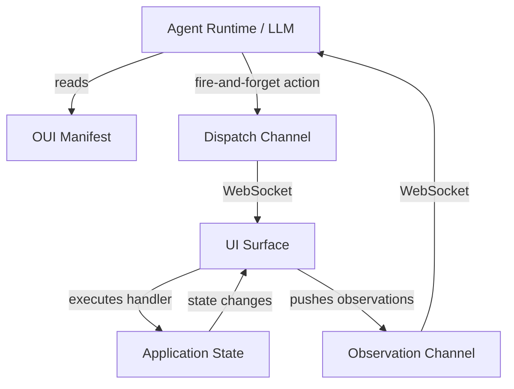
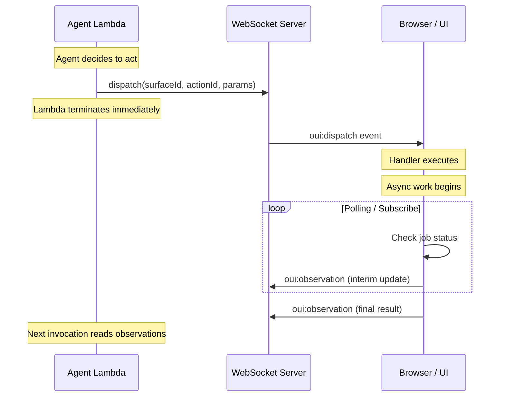

# OUI - The OpenUI Specification

**The machine-readable contract for agent-controllable user interfaces.**

> _"Oui"_ — French for "yes." As in: yes, an AI agent can control this UI.

<!-- Badges -->

[](https://www.npmjs.com/package/oui-spec)
[](LICENSE)
[](https://www.typescriptlang.org/)
[](https://github.com/wesreid/oui/actions/workflows/ci.yml)

---

## The Problem

AI agents that control UIs today rely on fragile, expensive hacks:

- **Computer vision** — screenshot the screen, feed it to a vision model, infer what's clickable, guess coordinates, click, screenshot again to see if it worked. Slow, expensive, unreliable.
- **DOM scraping** — find elements by CSS selector, simulate clicks and keystrokes. Breaks on every layout change. Requires intimate knowledge of the app's internal structure.
- **MCP tool servers** — powerful for backend operations, but have no concept of _UI state_. The agent can call APIs but can't observe what the user is seeing or coordinate with the frontend.

All of these share a fundamental flaw: **the agent is guessing what the application can do by examining its implementation details.** It's like reading a restaurant menu by peering into the kitchen.

## The Solution

OUI inverts the model. **The application declares a typed semantic surface** — what it can do, what state is observable, and what parameters each operation accepts. The agent reads this manifest and operates through typed function calls. No pixels. No DOM. No guessing.

```
OpenAPI  + HTTP Server  = any client can consume the API
OUI     + UI App        = any agent can control the UI
```



### Fully Async. Fully Stateless. No Waiting.

OUI uses **two one-way channels** — not request/response. This is the critical architectural decision:

| Channel         | Direction       | Purpose                              |
| --------------- | --------------- | ------------------------------------ |
| **Dispatch**    | Server → Client | Fire action instructions at the UI   |
| **Observation** | Client → Server | Push state updates back to the agent |

The agent runtime (e.g., a Lambda function) dispatches an action and **terminates immediately**. It does not wait for a response. The browser executes the action, starts any async work, and pushes observation updates over the observation channel as results arrive. The agent picks up those observations on its next invocation.

This means:

- **No Lambda waiting** — no 30-second timeouts holding a connection open
- **No request/response correlation** — no correlation IDs, no pending promises
- **No WebSocket held open by the server** — the server writes and disconnects
- **Long-running operations work naturally** — the UI polls or subscribes and pushes status updates over time

---

## Quick Start

The simplest possible OUI surface — a counter the agent can increment:

```typescript
// counter.surface.ts
import { defineSurface } from "oui-spec/core";

export const counterSurface = defineSurface({
  id: "counter",
  name: "Counter",
  description: "A simple counter that can be incremented or reset",
  actions: [
    {
      id: "increment",
      description: "Increment the counter by a given amount",
      input: {
        type: "object",
        properties: {
          amount: { type: "number", description: "Amount to add (default 1)" },
        },
      },
      handler: async (params, ctx) => {
        const amount = (params.amount as number) ?? 1;
        ctx.setCount(ctx.count + amount);
        return { success: true, data: { newValue: ctx.count + amount } };
      },
    },
    {
      id: "reset",
      description: "Reset the counter to zero",
      input: { type: "object", properties: {} },
      handler: async (_params, ctx) => {
        ctx.setCount(0);
        return { success: true, data: { newValue: 0 } };
      },
    },
  ],
  observations: [
    {
      id: "current_value",
      description: "The current counter value",
      schema: { type: "object", properties: { value: { type: "number" } } },
    },
  ],
});
```

```tsx
// CounterPage.tsx
import { useSurface, useObservation } from "oui-spec/react";
import { counterSurface } from "./counter.surface";

function CounterPage({ transport }) {
  const [count, setCount] = useState(0);

  const { handleActionRequest } = useSurface({
    surface: counterSurface,
    context: { count, setCount },
    send: transport.send,
  });

  // Push observation whenever count changes
  useObservation(
    counterSurface.id,
    "current_value",
    { value: count },
    transport.send,
  );

  return <div>Count: {count}</div>;
}
```

That's it. The agent now sees a `counter` surface with two tools (`increment`, `reset`) and one live observation (`current_value`).

---

## Architecture

### Two One-Way Channels



The dispatch channel carries action instructions **downward** (server → client). The observation channel carries state updates **upward** (client → server). They never mix. There is no concept of "waiting for a response."

### Why Not Request/Response?

In a typical agent architecture:

1. The agent runs in a Lambda (or similar serverless function)
2. The Lambda has a 30-second timeout
3. The UI operation might take 2 minutes (file upload, ML inference, user confirmation)

Request/response forces the Lambda to hold a connection open until the operation completes. That either times out or requires expensive long-running compute.

OUI's two-channel model means the Lambda does O(1) work — write a message to the dispatch channel and exit. The browser handles the rest on its own timeline and pushes results as observations. The agent reads those observations whenever it runs next.

---

## Polling & Async Operations

Many UI operations are not instant. A DataViz chart generation might take 30 seconds. A file export might need to wait for server-side rendering. OUI handles this with **declarative polling configuration**:

```typescript
{
  id: 'generate_chart',
  description: 'Generate a visualization from the configured dataset',
  async: true,
  estimatedDuration: '10-30s',
  input: {
    type: 'object',
    properties: {
      chartType: { type: 'string', enum: ['bar', 'line', 'scatter', 'pie'] },
      dataset: { type: 'string', description: 'Dataset ID to visualize' },
    },
    required: ['chartType', 'dataset'],
  },
  polling: {
    intervalMs: 2000,
    maxAttempts: 30,
    resolve: async (dispatchResult, ctx) => {
      const job = await ctx.api.getJobStatus(dispatchResult.jobId);
      if (job.status === 'complete') {
        return { done: true, data: { status: 'complete', chartUrl: job.outputUrl } };
      }
      return { done: false, data: { status: job.status, progress: job.progress } };
    },
  },
  handler: async (params, ctx) => {
    const job = await ctx.api.startChartGeneration(params);
    return { success: true, data: { jobId: job.id } };
  },
}
```

**What happens at runtime:**

1. Agent dispatches `generate_chart` with params
2. Handler fires, calls the API, returns `{ jobId: 'xyz' }` immediately
3. OUI runtime starts polling every 2 seconds using the `resolve` function
4. Each poll pushes an observation: `{ status: 'processing', progress: 45, interim: true }`
5. When `resolve` returns `{ done: true }`, polling stops and a final observation is pushed
6. The agent sees the final `{ status: 'complete', chartUrl: '...' }` observation on its next invocation

### Subscribe Mode (Alternative to Polling)

If you have realtime infrastructure (WebSocket events, SSE, etc.), you can use subscribe mode instead of polling:

```typescript
polling: {
  intervalMs: 0, // Not used in subscribe mode
  subscribe: {
    event: 'job:complete',
    filter: { jobId: '$dispatchResult.jobId' },
  },
},
```

The `$dispatchResult.` prefix tells the runtime to resolve the filter value from the handler's return data. The transport layer listens for the named event and pushes the observation when it arrives.

---

## Real-World Example: DataViz Surface

A complete DataViz wizard surface — the kind of thing you'd build for an AI-assisted analytics tool:

```typescript
// dataviz.surface.ts
import { defineSurface } from "oui-spec/core";
import type { DataVizContext } from "./types";

export const datavizSurface = defineSurface<DataVizContext>({
  id: "dataviz-wizard",
  name: "Data Visualization Wizard",
  description:
    "AI-controllable data visualization builder. Supports dataset selection, chart configuration, filtering, and export.",
  version: "1.0.0",

  activation: {
    routes: ["/studio/dataviz", "/studio/dataviz/*"],
    condition: "User has an active project with at least one dataset",
  },

  actions: [
    {
      id: "select_dataset",
      description:
        "Select a dataset to visualize. Must be called before configuring a chart.",
      input: {
        type: "object",
        properties: {
          datasetId: {
            type: "string",
            description: "The dataset ID from available_datasets observation",
          },
        },
        required: ["datasetId"],
      },
      handler: async (params, ctx) => {
        const dataset = await ctx.api.loadDataset(params.datasetId as string);
        ctx.updateState({ selectedDataset: dataset, step: "configure" });
        return {
          success: true,
          data: { columns: dataset.columns, rowCount: dataset.rowCount },
        };
      },
    },
    {
      id: "configure_chart",
      description: "Configure the chart type, axes, and visual options",
      input: {
        type: "object",
        properties: {
          chartType: {
            type: "string",
            enum: ["bar", "line", "scatter", "pie", "heatmap", "treemap"],
          },
          xAxis: { type: "string", description: "Column name for x-axis" },
          yAxis: { type: "string", description: "Column name for y-axis" },
          colorBy: {
            type: "string",
            description: "Column to use for color encoding (optional)",
          },
          aggregation: {
            type: "string",
            enum: ["sum", "avg", "count", "min", "max"],
            description: "Aggregation function for y-axis",
          },
        },
        required: ["chartType", "xAxis", "yAxis"],
      },
      preconditions: "A dataset must be selected first (select_dataset)",
      handler: async (params, ctx) => {
        ctx.updateState({ chartConfig: params, step: "preview" });
        return {
          success: true,
          data: { configured: true, chartType: params.chartType },
        };
      },
    },
    {
      id: "apply_filter",
      description: "Add a filter to narrow the visualized data",
      input: {
        type: "object",
        properties: {
          column: { type: "string" },
          operator: {
            type: "string",
            enum: ["eq", "neq", "gt", "gte", "lt", "lte", "in", "contains"],
          },
          value: { description: "Filter value — type depends on the column" },
        },
        required: ["column", "operator", "value"],
      },
      handler: async (params, ctx) => {
        const filters = [...ctx.state.filters, params];
        ctx.updateState({ filters });
        return { success: true, data: { filterCount: filters.length } };
      },
    },
    {
      id: "render_chart",
      description:
        "Render the configured chart. This is async — the chart is generated server-side.",
      async: true,
      estimatedDuration: "5-20s",
      input: {
        type: "object",
        properties: {
          quality: {
            type: "string",
            enum: ["draft", "production"],
            description: "Render quality",
          },
        },
      },
      polling: {
        intervalMs: 2000,
        maxDurationMs: 60000,
        resolve: async (dispatchResult, ctx) => {
          const result = dispatchResult as { jobId: string };
          const status = await ctx.api.getRenderStatus(result.jobId);
          if (status.state === "complete") {
            return {
              done: true,
              data: {
                status: "complete",
                imageUrl: status.imageUrl,
                renderTimeMs: status.durationMs,
              },
            };
          }
          if (status.state === "failed") {
            return {
              done: true,
              data: { status: "failed", error: status.error },
            };
          }
          return {
            done: false,
            data: { status: "rendering", progress: status.progress },
          };
        },
      },
      handler: async (params, ctx) => {
        const job = await ctx.api.startRender({
          dataset: ctx.state.selectedDataset.id,
          config: ctx.state.chartConfig,
          filters: ctx.state.filters,
          quality: (params.quality as string) ?? "draft",
        });
        return { success: true, data: { jobId: job.id } };
      },
    },
    {
      id: "export_chart",
      description: "Export the rendered chart as PNG, SVG, or PDF",
      input: {
        type: "object",
        properties: {
          format: { type: "string", enum: ["png", "svg", "pdf"] },
          width: {
            type: "number",
            description: "Export width in pixels (default 1200)",
          },
          height: {
            type: "number",
            description: "Export height in pixels (default 800)",
          },
        },
        required: ["format"],
      },
      preconditions: "A chart must be rendered first (render_chart)",
      handler: async (params, ctx) => {
        const url = await ctx.api.exportChart(
          ctx.state.renderedChart.id,
          params,
        );
        return {
          success: true,
          data: { downloadUrl: url, format: params.format },
        };
      },
    },
  ],

  observations: [
    {
      id: "available_datasets",
      description:
        "List of datasets available for visualization in the current project",
      schema: {
        type: "array",
        items: {
          type: "object",
          properties: {
            id: { type: "string" },
            name: { type: "string" },
            rowCount: { type: "number" },
            columns: { type: "array", items: { type: "string" } },
          },
        },
      },
      updateFrequency: "on-change",
    },
    {
      id: "wizard_state",
      description:
        "Current state of the DataViz wizard — which step the user is on and what is configured",
      schema: {
        type: "object",
        properties: {
          step: {
            type: "string",
            enum: ["select", "configure", "preview", "export"],
          },
          selectedDatasetId: { type: "string" },
          chartConfig: { type: "object" },
          filters: { type: "array" },
          renderedChartUrl: { type: "string" },
        },
      },
      updateFrequency: "on-change",
    },
  ],
});
```

### Using the Surface in React

```tsx
// DataVizPage.tsx
import { useSurface, useObservation } from "oui-spec/react";
import { createWebSocketTransport } from "oui-spec/transport";
import { datavizSurface } from "./dataviz.surface";

export function DataVizPage() {
  const { state, updateState, api } = useDataVizWizard();
  const transport = useTransport(); // your app's transport setup

  const { handleActionRequest } = useSurface({
    surface: datavizSurface,
    context: { state, updateState, api },
    send: transport.pushObservation,
    active: true,
  });

  // Push observations whenever relevant state changes
  useObservation(
    datavizSurface.id,
    "wizard_state",
    {
      step: state.step,
      selectedDatasetId: state.selectedDataset?.id,
      chartConfig: state.chartConfig,
      filters: state.filters,
      renderedChartUrl: state.renderedChart?.imageUrl,
    },
    transport.pushObservation,
  );

  useObservation(
    datavizSurface.id,
    "available_datasets",
    state.datasets,
    transport.pushObservation,
  );

  // Wire transport to surface
  useEffect(() => {
    return transport.onAction((surfaceId, actionId, params) => {
      handleActionRequest({
        surfaceId,
        actionId,
        params,
        requestId: "",
        timestamp: Date.now(),
      });
    });
  }, [handleActionRequest, transport]);

  return <DataVizWizardUI state={state} />;
}
```

### What the Agent Sees

The agent runtime receives the manifest and exposes these tools to the LLM:

```
Tools available:
  - select_dataset(datasetId: string) — Select a dataset to visualize
  - configure_chart(chartType, xAxis, yAxis, ...) — Configure chart type and axes
  - apply_filter(column, operator, value) — Add a data filter
  - render_chart(quality?) — Render the chart (async, 5-20s)
  - export_chart(format, width?, height?) — Export as PNG/SVG/PDF

Observations:
  - available_datasets — [{id, name, rowCount, columns}]
  - wizard_state — {step, selectedDatasetId, chartConfig, ...}
```

The agent can orchestrate the full wizard: select data → configure chart → filter → render → export. All through typed, validated function calls. No screenshots. No DOM selectors.

---

## Subpath Imports

The `oui-spec` package exposes subpath exports for granular imports:

```typescript
import { defineSurface } from "oui-spec/core";
import { useSurface } from "oui-spec/react";
import { createWebSocketTransport } from "oui-spec/transport";
import type { OUISurface, OUIAction } from "oui-spec/spec";

// Or import everything from the root
import { defineSurface, useSurface, createWebSocketTransport } from "oui-spec";
```

| Subpath              | Description                                                                  |
| -------------------- | ---------------------------------------------------------------------------- |
| `oui-spec/spec`      | TypeScript types + JSON Schema for the OUI specification. Zero runtime deps. |
| `oui-spec/core`      | `defineSurface()`, manifest extraction, action execution, polling config.    |
| `oui-spec/react`     | `useSurface()` hook, `useObservation()` helper. React bindings.              |
| `oui-spec/transport` | Two-channel transport layer. WebSocket (Socket.IO), direct (in-memory).      |

---

## How OUI Relates to OpenAPI

OUI and OpenAPI are **complementary**, not competing:

|                      | OpenAPI                     | OUI                            |
| -------------------- | --------------------------- | ------------------------------ |
| **Describes**        | HTTP endpoints              | UI capabilities                |
| **Operates on**      | Network requests            | Application state              |
| **Agent uses it to** | Call backend APIs           | Control frontend UIs           |
| **State awareness**  | None (stateless HTTP)       | Observations push live state   |
| **Async model**      | Webhooks / polling (manual) | Built-in polling runtime       |
| **Schema format**    | JSON Schema                 | JSON Schema                    |
| **Transport**        | HTTP                        | WebSocket, postMessage, direct |

An application can expose **both**: an OpenAPI spec for its REST API and an OUI manifest for its UI. An agent that needs to "call the API" uses OpenAPI. An agent that needs to "use the app" uses OUI.

They even share JSON Schema for parameter validation — a deliberate design choice so the ecosystem tooling (validators, code generators, documentation) works with both.

---

## Comparison Table

|                        | Vision / Screenshot            | DOM Scraping              | MCP Tools                 | **OUI**                                 |
| ---------------------- | ------------------------------ | ------------------------- | ------------------------- | --------------------------------------- |
| **Discovery**          | Infer from pixels              | Parse HTML structure      | Read tool manifests       | Read surface manifest                   |
| **Actions**            | Click (x, y)                   | `querySelector().click()` | `call_tool(name, params)` | `dispatch(surfaceId, actionId, params)` |
| **Feedback**           | Screenshot & compare           | Check DOM changed         | Tool returns response     | Observation pushed async                |
| **UI awareness**       | Full (but expensive)           | Structural only           | None                      | Declared observations                   |
| **Reliability**        | Breaks on style/layout changes | Breaks on DOM changes     | Stable (typed)            | Stable (typed)                          |
| **Cost per action**    | ~$0.01-0.05 (vision model)     | Near zero                 | Near zero                 | Near zero                               |
| **Latency**            | 2-10s (screenshot + inference) | <100ms                    | <100ms                    | <100ms                                  |
| **Async operations**   | Poll screenshots               | Poll DOM                  | Not built-in              | Declarative polling runtime             |
| **Consent model**      | Everything visible             | Everything in DOM         | Server declares tools     | App declares surface                    |
| **Framework coupling** | None                           | Tight (HTML-specific)     | None                      | None (spec is universal)                |
| **Complex workflows**  | Dozens of screenshots          | Dozens of selectors       | Multiple tool calls       | Multiple dispatches + observations      |

---

## Principles

1. **App-declared, not inferred.** The application explicitly states what it supports. Agents don't guess from pixels or DOM.
2. **Semantic, not structural.** Actions are named operations (`render_chart`), not DOM paths (`click #btn-render`).
3. **Typed end-to-end.** Inputs and outputs use JSON Schema. The agent knows exactly what to send and expect.
4. **Fully async.** Dispatch is fire-and-forget. Results arrive as observations. No blocking, no timeouts.
5. **Two channels, one direction each.** Dispatch goes down. Observations go up. Never mixed.
6. **Framework-agnostic.** The spec works with React, Vue, Svelte, vanilla JS, native apps — anything that can handle a function call and emit an event.
7. **Observable.** The agent reads relevant state without screenshots. The app pushes state changes when they happen.
8. **Consent-based.** The app controls what's exposed. Users and developers decide what agents can do.
9. **Composable.** Multiple surfaces coexist. A complex app exposes many surfaces (one per feature/page).
10. **Complementary.** OUI doesn't replace OpenAPI, MCP, or any other standard. It fills the "UI control" gap they leave open.

---

## Status

🚧 **Active development.** The specification (v0.1) and core packages are functional and in use within the Closure AI Studio platform. The public API is stabilizing but may change before 1.0.

### Roadmap

- [x] Specification v0.1
- [x] `oui-spec/spec` — Types package
- [x] `oui-spec/core` — `defineSurface()` + manifest extraction
- [x] `oui-spec/react` — `useSurface()` hook + observation helpers
- [x] `oui-spec/transport` — WebSocket + Direct transports
- [ ] `oui-spec/devtools` — Surface inspector / debugger
- [ ] `oui-spec/vue` — Vue bindings
- [ ] `oui-spec/validator` — Runtime schema validation
- [ ] Specification v1.0

---

## Contributing

Contributions welcome. Please read the spec at [`spec/OUI-SPEC-v0.1.md`](./spec/OUI-SPEC-v0.1.md) before proposing changes to ensure alignment with the design principles.

```bash
# Clone and install
git clone https://github.com/wesreid/oui.git
cd oui
npm install

# Build
npm run build

# Run tests
npm test

# Typecheck
npm run typecheck
```

---

## License

MIT
