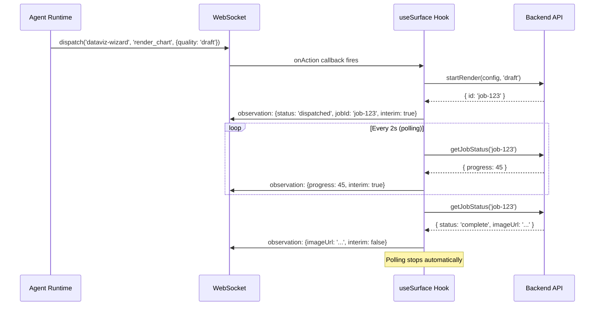

# @oui/react

**React bindings for OUI surfaces. `useSurface()` + `useObservation()`.**

This package connects OUI surface definitions to the React component lifecycle. It handles surface registration/deregistration, action execution, polling management, and observation pushing — all through a single hook.

---

## Install

```bash
pnpm add @oui/react
```

Peer dependencies: `react` (>=18.0.0), `@oui/spec`, `@oui/core`.

---

## `useSurface()`

The primary hook. Registers a surface with the agent runtime, handles incoming action dispatches, manages polling lifecycles, and provides controls for stopping polls.

```tsx
import { useSurface } from '@oui/react';
import { mySurface } from './my.surface';

function MyPage() {
  const [state, setState] = useState(initialState);
  const transport = useTransport(); // your app's transport

  const { handleActionRequest, surfaceId, manifest } = useSurface({
    surface: mySurface,
    context: { state, setState },
    send: transport.pushObservation,
    active: true,
  });

  // Wire transport dispatch channel to this surface
  useEffect(() => {
    return transport.onAction((surfaceId, actionId, params) => {
      handleActionRequest({
        surfaceId,
        actionId,
        params,
        requestId: crypto.randomUUID(),
        timestamp: Date.now(),
      });
    });
  }, [handleActionRequest, transport]);

  return <MyUI state={state} />;
}
```

### Options

| Option | Type | Description |
|--------|------|-------------|
| `surface` | `DefinedSurface<TContext>` | The surface from `defineSurface()` |
| `context` | `TContext` | App state/utilities passed to action handlers. Updated on every render via ref. |
| `send` | `(event) => void` | Transport send function for pushing observations |
| `active` | `boolean` | Whether the surface is currently active (default `true`) |

### Return Value

| Property | Type | Description |
|----------|------|-------------|
| `handleActionRequest` | `(request: OUIActionRequest) => Promise<void>` | Feed incoming action dispatches to this function |
| `surfaceId` | `string` | The surface's ID |
| `manifest` | `OUISurface` | The extracted manifest (schema only) |
| `stopPolling` | `(actionId: string) => void` | Manually stop polling for a specific action |
| `stopAllPolling` | `() => void` | Stop all active pollers |

### Lifecycle

1. **Mount / `active: true`** — sends `surface:register` with the full manifest
2. **Action received** — executes handler, pushes observation with result
3. **Async action** — starts polling loop, pushes interim observations until done
4. **Unmount / `active: false`** — sends `surface:deregister`, clears all pollers

---

## `useObservation()`

Pushes an observation update to the agent whenever the value changes. Uses shallow JSON comparison to avoid redundant pushes.

```tsx
import { useObservation } from '@oui/react';

function DataVizPage() {
  const { state } = useDataVizWizard();
  const transport = useTransport();

  // Pushed automatically whenever state.step, config, etc. change
  useObservation('dataviz-wizard', 'wizard_state', {
    step: state.step,
    selectedDatasetId: state.selectedDataset?.id,
    chartConfig: state.chartConfig,
    filters: state.filters,
  }, transport.pushObservation);

  useObservation('dataviz-wizard', 'available_datasets', state.datasets, transport.pushObservation);

  return <WizardUI />;
}
```

### Parameters

| Param | Type | Description |
|-------|------|-------------|
| `surfaceId` | `string` | Which surface this observation belongs to |
| `observationId` | `string` | Unique observation ID (matches your surface definition) |
| `value` | `unknown` | The current observation value |
| `send` | `(event) => void` | Transport send function |

The hook serializes `value` via `JSON.stringify` and only pushes when the serialized form changes from the previous render.

---

## Complete Example: DataViz Surface

```tsx
// dataviz.surface.ts
import { defineSurface } from '@oui/core';

interface DataVizContext {
  state: WizardState;
  updateState: (patch: Partial<WizardState>) => void;
  api: DataVizApi;
}

export const datavizSurface = defineSurface<DataVizContext>({
  id: 'dataviz-wizard',
  name: 'Data Visualization Wizard',
  description: 'Build and export data visualizations',
  actions: [
    {
      id: 'select_dataset',
      description: 'Choose a dataset to visualize',
      input: {
        type: 'object',
        properties: { datasetId: { type: 'string' } },
        required: ['datasetId'],
      },
      handler: async (params, ctx) => {
        const ds = await ctx.api.loadDataset(params.datasetId as string);
        ctx.updateState({ selectedDataset: ds, step: 'configure' });
        return { success: true, data: { columns: ds.columns } };
      },
    },
    {
      id: 'render_chart',
      description: 'Render the chart (async, server-side)',
      async: true,
      estimatedDuration: '5-20s',
      input: {
        type: 'object',
        properties: { quality: { type: 'string', enum: ['draft', 'production'] } },
      },
      polling: {
        intervalMs: 2000,
        maxDurationMs: 60000,
        resolve: async (dispatchResult, ctx) => {
          const { jobId } = dispatchResult as { jobId: string };
          const job = await ctx.api.getJobStatus(jobId);
          if (job.status === 'complete') {
            return { done: true, data: { imageUrl: job.imageUrl } };
          }
          return { done: false, data: { progress: job.progress } };
        },
      },
      handler: async (params, ctx) => {
        const job = await ctx.api.startRender(ctx.state.chartConfig, params.quality);
        return { success: true, data: { jobId: job.id } };
      },
    },
  ],
  observations: [
    {
      id: 'wizard_state',
      description: 'Current step and config',
      schema: { type: 'object', properties: { step: { type: 'string' } } },
    },
  ],
});
```

```tsx
// DataVizPage.tsx
import { useSurface, useObservation } from '@oui/react';
import { datavizSurface } from './dataviz.surface';
import { useDataVizWizard } from './hooks';
import { useTransport } from './transport';

export function DataVizPage() {
  const { state, updateState, api } = useDataVizWizard();
  const transport = useTransport();

  const { handleActionRequest } = useSurface({
    surface: datavizSurface,
    context: { state, updateState, api },
    send: (event) => transport.pushObservation(event.payload),
    active: true,
  });

  // Push observations on state change
  useObservation('dataviz-wizard', 'wizard_state', {
    step: state.step,
    selectedDatasetId: state.selectedDataset?.id,
    chartConfig: state.chartConfig,
  }, (event) => transport.pushObservation(event.payload));

  // Connect dispatch channel → surface
  useEffect(() => {
    return transport.onAction((surfaceId, actionId, params) => {
      handleActionRequest({
        surfaceId,
        actionId,
        params,
        requestId: crypto.randomUUID(),
        timestamp: Date.now(),
      });
    });
  }, [handleActionRequest, transport]);

  return (
    <div>
      <h1>Data Visualization</h1>
      <WizardSteps step={state.step} />
      {state.step === 'select' && <DatasetPicker datasets={state.datasets} />}
      {state.step === 'configure' && <ChartConfigurator />}
      {state.step === 'preview' && <ChartPreview imageUrl={state.renderedChart?.imageUrl} />}
    </div>
  );
}
```

### What Happens When the Agent Dispatches `render_chart`



---

## Exports

```typescript
export { useSurface, useObservation } from '@oui/react';
export type { UseSurfaceOptions } from '@oui/react';
```

---

## License

MIT
